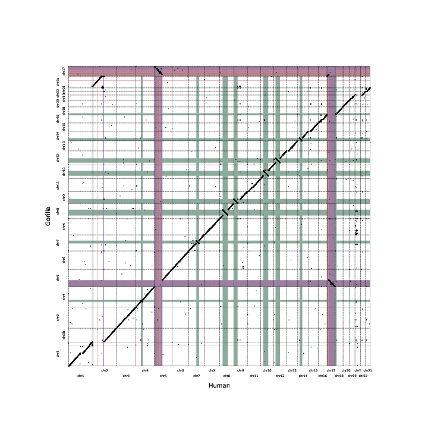

# svgenes
This program finds syntenic regions between two genomes, explicitly noting inversions, chromosomal translocations, and inverted translocations.

 

Rather than directly comparing sequence, this is done by comparing locations of genes.

### Outputs
* BED file listing syntenic blocks on genome1 -> genome2, including orientation
* BED file listing syntenic blocks on genome2 -> genome1, including orientation
* List of genes present in inverted regions
* List of genes present in translocated regions
* List of genes present in inverted translocated regions
* Plot showing synteny between genomes (and identified inverted/translocated regions)

## Installation
```
conda create --file=svgenes.yml
```

## Running
```
./svgenes.py --anno1 [gtf/gff3 file 1] \
    --anno2 [gtf/gff3 file 2] \
    --fai1 [FAI file for species 1] \
    --fai2 [FAI file for species 2] \
    --species1 [name of species 1] \
    --species2 [name of species 2] \
    --output [output file prefix ]
```
